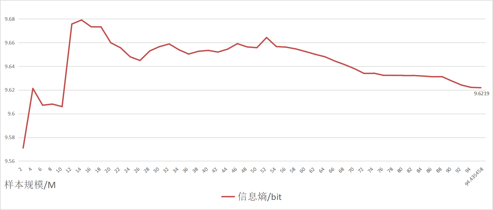
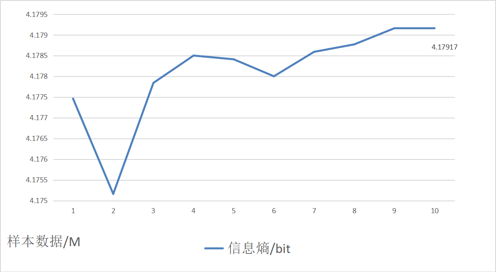
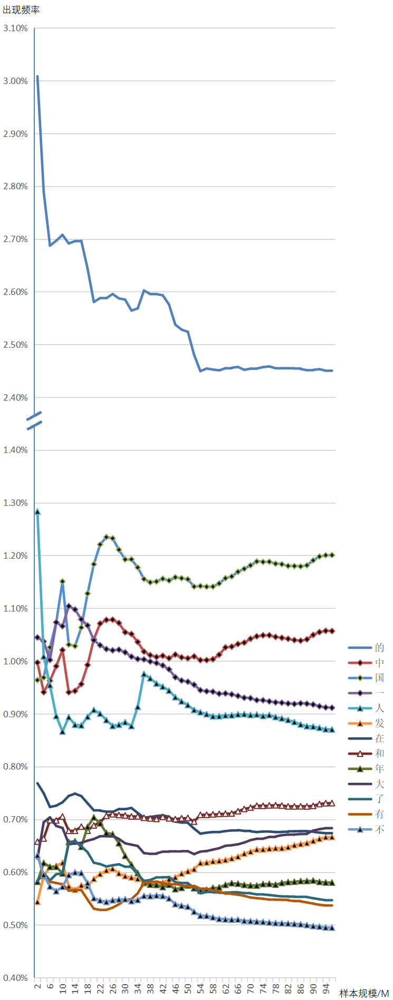

# <center>技术报告</center>

### <center>熊伟强 2020K8009925009</center>
## 问题描述
&emsp;&emsp;分别收集尽量多的英语和汉语文本，编写程序计算这些文本中英语字母和汉字的熵，对比本章课件第12页上表中给出的结果。然后逐步扩大文本规模，如每次增加2M，重新计算文本规模扩大之后的熵，分析多次增加之后熵的变化情况。

## 爬虫工具
&emsp;&emsp;本次作业用到的爬虫工具有：**[Newspaper3k](https://github.com/codelucas/newspaper)**、**[BeautifulSoup4](https://www.crummy.com/software/BeautifulSoup)**。

&emsp;&emsp;`Newspaper3k`是一个用来提取新闻文章的Python库。其可以通过文章的URL分析并提取文章的作者、标题、正文、图片等信息。其有时不稳定，但胜在便捷。

&emsp;&emsp;`BeautifulSoup4`是一个相当经典的可以从HTML或XML文件中提取数据的Python库。

## 数据样本
&emsp;&emsp;本作业汉语收集数据为`zh-CN`。数据来源：**[人民日报图文数据库](http://data.people.com.cn/rmrb/)**；样本范围：2019年1月1日至2022年12月31日在《人民日报》上刊登的文章。

&emsp;&emsp;本作业英语收集数据为`en-US`。数据来源：**[ABC News](https://abcnews.go.com/)**、**[AP News](https://abcnews.go.com/)**、**[CBS News](https://www.cbsnews.com/)、[CNN](https://edition.cnn.com/)**、**[Fox News](https://www.foxnews.com/)**、**[National Geographic](https://www.nationalgeographic.com/)**。样本范围：3月11日以上网站大部分子分类（`category`，如`politics`、`science`等）网站的第一页刊登的文章。

## 数据清洗
&emsp;&emsp;对于`zh-CN`数据，利用Python的re模块进行清洗。利用UTF-8中文编码的常用过滤范围`[\u4e00-\u9fa5]`，进行正则表达式匹配。相关代码如下：
```Python
with open('./raw/%d/%d-%d.txt'%(year, year, month), 'r', encoding='utf-8') as fin:
    temp = fin.read()
with open('./cleaned/%d/%d-%d.txt'%(year, year, month), 'w', encoding="utf-8") as fout:
    fout.write(re.sub('[^\u4e00-\u9fa5]+','', temp))
```
&emsp;&emsp;上述代码将不属于中文编码范围的所有字符替换为空，只留下中文字符并保存到本地。

&emsp;&emsp;而`en-US`数据同样可以通过正则表达式匹配的方式清洗数据。并且英文只需要考虑26个字母，不需要考虑UTF-8的英文字母编码。但是英文存在大小写之分，因此需要将大写字母转成小写字母再进行正则表达式替换操作：
```Python
with open('./raw/%s/%s'%(data, filename), 'r', encoding='utf-8') as fin:
    temp = fin.read().lower()
with open('./cleaned/%s/%s'%(data, filename), 'w', encoding="utf-8") as fout:
    fout.write(re.sub('[^a-z]+','', temp))
```
&emsp;&emsp;上述代码先将原数据的大写英文字母转为小写，再将不属于小写英文字母的所有字符替换为空，只留下小写英文字符并保存到本地。

## 计算结果
### zh-CN
&emsp;&emsp;经过清洗后样本规模大小为94435458（约94.4M）字。以下是根据清洗后的样本计算单个汉字的信息熵。


&emsp;&emsp;从图中可以看到，单个汉字的信息熵约为9.62bits。

### en-US
&emsp;&emsp;经过清洗后样本规模大小为9039328（约9.03M）字。以下是根据清洗后的样本计算单个英文字母（不包括空格）的信息熵。


&emsp;&emsp;从图中可以看到，单个英文字母的信息熵约为4.18bits。

## 思考
&emsp;&emsp;数据源选择上，笔者以报刊类网站为主。这些网站在语言规范上做得比较好，并且反爬虫措施比较少。但同时，报刊的一些措辞和日常生活措辞有所区别，其对语言信息熵计算可能有部分影响。笔者认为，这一点在汉语上体现比较大：在汉语中单个汉字有具体的含义，一些用字频率上升或下降会直接影响信息熵计算；而英文通常需要单词（多个字母的组合）才能表达含义，词频的变化作用在单个字母上应当不会特别明显。

&emsp;&emsp;数据样本规模上，汉语的样本规模要明显大于英语（94M对9M）。这是因为笔者人民日报图文数据库的数据比较好抓取，每一篇文章的URL有规律，能够使用`newspaper`工具快速抓取；而英语由于国内限制，能够直接访问的美国网站并不多（笔者尝试使用代理，但是程序运行时出现SSL错误，解决起来比较麻烦，遂只挑选可以直连的美国网站）。

&emsp;&emsp;此外，汉语和数据样本都存在极少量的文本重复情况。汉语方面，极少数长文章会占据两个或多个版面，这样导致抓取的数据会有重复；英语方面，由于抓取的是同一天的数据，对于一些比较重大的新闻（例如笔者在抓取数据时——3月11日当天，伊朗和沙特阿拉伯在中国斡旋下重新建交，各大美国媒体纷纷报道）、一些细节描述（比如引用当事人话语、专有名词等）会有部分重复的情况。但笔者认为，这对计算信息熵的影响并不大。

&emsp;&emsp;最后还有一个比较有趣的发现。在计算汉语信息熵时，数据是按照时间顺序(从2019年1月1日开始）读入的。这也意味着之前计算的[汉语信息熵图](###zh-CN)的横坐标可以表示时间。笔者也记录了《人民日报》使用的频率最高的10个词（2019年1月1日-2022年12月31日）：
```
'的': 2.45%
'国': 1.20%
'中': 1.06%
'一': 0.91%
'人': 0.87%
'和': 0.73%
'大': 0.68%
'在': 0.67%
'发': 0.67%
```
&emsp;&emsp;我们可以看到，《人民日报》的部分用字具有较明显的倾向性，一些字的出现频率出乎常理的高。笔者认为，鉴于《人民日报》的特殊地位，在人文社科领域，研究其用字频率或许是一个思路。同时，笔者统计了《人民日报》中一些常用字的使用频率，并绘制了这些字频率随样本规模（等价于时间）的变化曲线，供读者参阅：
