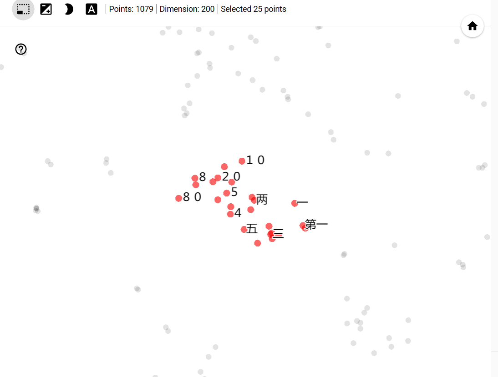

# <center>技术报告</center>

### <center>熊伟强 2020K8009925009</center>
## 问题描述
&emsp;&emsp;请下载调试FNN、RNN和LSTM模型的开源工具。利用北京大学标注的《人民日报》1998年1月份的分词语料，或者利用网络爬虫自己从互联网上收集足够多的英文文本语料，借助FNN或者RNN/LSTM开源工具，完成如下任务：
- 获得汉语或英语词语的词向量;
- 在上一任务的基础上，随机选择20个单词，计算与其词向量最相似的前10个单词。
- 对于同一批词汇，对比分别用FNN,RNN或LSTM获得的词向量的差异。

## 数据清洗
&emsp;&emsp;本次任务使用北京大学标注的《人民日报》1998年1月份的分词语料。由于语料已经进行了分词，清洗数据是比较容易的。相关代码如下：
```Python
import re
from zhon.hanzi import punctuation

with open('ChineseCorpus199801.txt', 'r', encoding='GBK') as fin:
    # 读取数据，注意语料采用的是GBK编码，默认使用的UTF-8会出现乱码
    text = fin.read()
    # 清除行首标记，例如：19980101-01-001-001/m
    text = re.sub(r'(\d{8}-\d{2}-\d{3}-\d{3})?/[a-zA-Z]+', "", text)
    # 清除标点符号
    text = re.sub("[{}]+".format(punctuation), "", text)
    # 部分词性标记结构不符合以上正则匹配。
    # 比如：[老挝/ns  国会/n]nt、[中东/ns  地区/n]ns
    text = re.sub(r"[\[(\]nt)]", "", text)
    text = re.sub("[a-z]", "", text)
    # 输出清洗后结果
    with open('cleaned.txt', 'w', encoding='GBK') as fout:
        fout.write(text)
```
&emsp;&emsp;处理前的语料为[ChineseCorpus199801.txt](ChineseCorpus199801.txt)，处理后的文件为[cleaned.txt](cleaned.txt)，供读者参考。以下展示处理前后的部分结果：

&emsp;&emsp;处理前：
```
19980101-01-001-001/m  迈向/v  充满/v  希望/n  的/u  新/a  世纪/n  ——/w  一九九八年/t  新年/t  讲话/n  （/w  附/v  图片/n  １/m  张/q  ）/w  
19980101-01-001-002/m  中共中央/nt  总书记/n  、/w  国家/n  主席/n  江/nr  泽民/nr  
19980101-01-001-003/m  （/w  一九九七年/t  十二月/t  三十一日/t  ）/w  
```
&emsp;&emsp;处理后：
```
  迈向  充满  希望  的  新  世纪    一九九八年  新年  讲话    附  图片  １  张    
  中共中央  总书记    国家  主席  江  泽民  
    一九九七年  十二月  三十一日    
```

## 获取词向量的简单实现
&emsp;&emsp;本次作业笔者利用PyTorch，实现了一个简单的神经网络用于获取词向量。此处笔者采用Skip-Gram模型，即用一个词去预测附近多个词的概率。以下是代码实现：
```Python
import torch
import torch.nn as nn
import torch.optim as optim
import collections
import matplotlib.pyplot as plt
import numpy as np
import re

# 读取处理后的汉语语料
corpus = []
lines = []
with open('../cleaned.txt', 'r', encoding='GBK') as f:
    text = f.read()
    corpus = text.split()
    lines = text.strip().split('\n')
words_set = list(collections.OrderedDict.fromkeys(corpus).keys())

vocab_size = len(words_set)
# 窗口大小，C = 2代表读取上下文前后各2个词
C = 2

word_to_id = {word: i for i, word in enumerate(words_set)}
id_to_word = {word_to_id[word]: word for word in word_to_id}

# 构建输入输出数据对
skip_grams = []
# 逐行读取并标记
for line in lines:
    line_words = re.split("[ ]+", line.strip())
    for idx in range(C, len(line_words) - C):
        # 中心词索引
        center = word_to_id[line_words[idx]]
        # 上下文词索引
        context_idx = list(range(idx - C, idx)) + list(range(idx + 1, idx + C + 1))
        context = [word_to_id[line_words[i]] for i in context_idx]
        for w in context:
            skip_grams.append([center, w])

# 定义模型
class myModel(nn.Module):
    def __init__(self, vocab_size, embedding_dim):
        super(myModel, self).__init__()
        self.embed = nn.Embedding(vocab_size, embedding_dim)
        self.linear = nn.Linear(embedding_dim, vocab_size)
        self.softmax = nn.Softmax(dim=1)

    def forward(self, x):
        x = self.embed(x)
        x = self.linear(x)
        x = self.softmax(x)
        return x


# 定义词向量维数
embedding_dim = 10

# 初始化模型
device = torch.device('cpu')
model = myModel(vocab_size, embedding_dim).to(device)
# 损失函数
criterion = nn.CrossEntropyLoss()
# 优化
optimizer = optim.Adam(model.parameters(), lr=0.003)

# 训练模型
epochs = 50
batch_size = 10000
model.train()
loss_list = []
for epoch in range(epochs):
    for batch in range(0, len(skip_grams) - batch_size, batch_size):
        input = torch.tensor(skip_grams[batch:batch + batch_size][0]).long().to(device)
        output = torch.tensor(skip_grams[batch:batch + batch_size][1]).long().to(device)
        out = model(input)
        loss = criterion(out, output)
        optimizer.zero_grad()
        loss.backward()
        optimizer.step()
        print("epoch: %d, batch: %d" % (epoch, batch))
    loss_list.append(loss)

# 绘制训练损失的折线图
y = plt.plot([y.detach().numpy() for y in loss_list])
plt.title('Training Loss')
plt.xlabel('Epochs')
plt.ylabel('Loss')
plt.savefig('training_loss.jpg')

# 获取词向量
word_vectors = model.embed.weight.data.numpy()
# 保存到本地
np.savetxt('word_vectors.csv', np.array(word_vectors), delimiter=',')
```

<center>本次训练的loss曲线</center>

&emsp;&emsp;最后我们得到了文本中所有词的词向量，并保存在文件[word_vectors.csv](./MyModel/word_vectors.csv)中。需要注意的是，保存的文件只有向量，没有向量对应词。因此使用前还需要对该文件加上必要信息。相关代码如下：
```Python
import pandas as pd
from collections import OrderedDict

df = pd.read_csv('word_vectors.csv', header=None, names=['vec0', 'vec1', 'vec2', 'vec3', 'vec4', 'vec5', 'vec6', 'vec7', 'vec8', 'vec9'])
f = open('../cleaned.txt', 'r', encoding='GBK')
text = f.read()
corpus = text.split()
words_set = list(OrderedDict.fromkeys(corpus).keys())
df.insert(0, 'word', '')
df['word'] = words_set
df.to_csv('modified_word_vectors.csv', index=False, encoding='GBK')
```
&emsp;&emsp;修改前（[word_vectors.csv](./MyModel/word_vectors.csv)）：
```
2.884644269943237305e+00,3.311291217803955078e+00,...
1.345650553703308105e-01,-9.079240262508392334e-02,...
...
```
&emsp;&emsp;修改后（[modified_word_vectors.csv](./MyModel/modified_word_vectors.csv)）：
```
word,vec0,vec1,...,vec9
迈向,2.8846442699432373,3.311291217803955,...,-3.7107329368591304
充满,0.1345650553703308,-0.09079240262508392,...,-0.9368700981140136
...
```
&emsp;&emsp;由此，我们获得了文本的词向量。

&emsp;&emsp;接下来计算与其词向量最相似的前10个单词。我们采用余弦相似度来计算两个词的相似度。相关代码如下：
```Python
import csv
from sklearn.metrics.pairwise import cosine_similarity
import numpy as np

# 读取词向量 CSV 文件
word_vectors = []
words = []
with open('modified_word_vectors.csv', 'r', encoding='GBK') as f:
    reader = csv.reader(f)
    for i, row in enumerate(reader):
        if i == 0:
            continue  # 跳过表头
        word_vectors.append([float(x) for x in row[1:]])
        words.append(row[0])

# 计算一个单词w和其他单词的相似度
def find_similar_words(w, k=10):
    index = words.index(w)
    if index == -1:
        return []
    v1 = word_vectors[index]
    sims = []
    for i in range(len(words)):
        if i == index:
            continue
        v2 = word_vectors[i]
        sim = cosine_similarity(np.array(v1).reshape(1, -1), np.array(v2).reshape(1, -1))
        sims.append((words[i], sim.item()))
    sims = sorted(sims, key=lambda x: x[1], reverse=True)[:k]
    return sims

# 测试代码
similar_words = find_similar_words('青年')
print(similar_words)
```
&emsp;&emsp;实际上测试的结果并不理想，比如此处测试”中国“一词，得到的结果如下：
```
[('挪威', 0.9168188585553992), 
('意识形态', 0.9154071869052486), 
('抒情', 0.897617299774811), 
('娃子', 0.8956316472966679), 
('今夏', 0.8955808676699177), 
('男排', 0.893288982629511), 
('智燕', 0.8882323003492963), 
('单淘汰制', 0.8877162624471574), 
('哲学家', 0.8876739187452148), 
('青年队', 0.8807108433336709)]
```
&emsp;&emsp;从上面的结果可以看到，测试的结果大多数没有太大联系，反而一些更相近的词排在后面。笔者认为这与词向量维数有直接关系。此处我们只训练了10维的词向量，这个维数是相当低的。而训练更大维数的词向量将会严重影响运算速度。接下来将介绍利用Gensim的Word2Vec模型获取词向量。

## 利用Word2Vec模型获取词向量
&emsp;&emsp;利用Gensim的Word2Vec模型可以方便快捷地获取词向量。以下是相关代码：
```Python
from gensim.models import Word2Vec
import re

# 分词
lines = []
corpus = []
with open('../cleaned.txt', 'r', encoding='GBK') as f:
    lines = f.read().strip().split('\n')
for line in lines:
    line_words = re.split("[ ]+", line.strip())
    corpus.append(line_words)
for line_words in corpus:
    if '' in line_words:
        line_words.remove('')
corpus = list(filter(None, corpus))
# 调参
model = Word2Vec(corpus, sg=1, vector_size=200, window=2, min_count=5, hs=1,
                 sample=0.001, workers=4)

model.save('model')
```
&emsp;&emsp;此处我们训练了一个200维词向量的模型。并且将模型保存，之后可以随时调用。获取词向量以及找到最相近的词的操作相当简单。相关代码如下：
```Python
import gensim

# 加载模型
model = gensim.models.Word2Vec.load('model')

# 获取词向量
print(model.wv['青年'])

# 输出最相近的10个词
most_similar = model.wv.similar_by_word('青年')

for i in range(10):
    print(most_similar[i][0], most_similar[i][1])
```
&emsp;&emsp;`print(model.wv['青年'])`结果为一个200维向量列表，在此不便展示。在此仅展示相似词输出结果：
```
服务队 0.644002377986908
志愿者 0.6040948033332825
大学生 0.5956432223320007
中小学 0.5752847790718079
星火 0.5714483857154846
在校 0.559515655040741
辅导 0.5565535426139832
企业家 0.5565165281295776
教师 0.5539447069168091
带头人 0.5523191094398499
```
&emsp;&emsp;可以看到，得出的词和原词的确具有一定的相关性。笔者选取了20个词，得到相应结果，记录在[test_result.txt](./word2vec/test_result.txt)中。

## 思考
&emsp;&emsp;本次作业笔者对神经网络有了进一步的了解，在搭建神经网络、调试过程中，多次发现训练效果不尽人意（主要体现在相似度测试结果上）。最初尝试更换激活函数、损失函数，引入Dropout层等方式解决，但结果均不佳。最后认为是词向量维数太低，因为在使用Word2Vec模型时，将维数设置为10同样出现类似问题。后将维数设置为100，结果明显优于前者；设置为200效果更佳。笔者尝试将自己训练的模型维数参数修改得更大一些，但运算速度实在太慢，遂放弃。有现成的模型调参的确是一件方便的事，但是背后的原理不清楚的话，很难会有质的提升。比如这里我已经发现了问题，但是模型背后应做的各种优化我并不清楚，因此直接限制了对模型的改进。这种事情是不能通过调参就能解决的。

&emsp;&emsp;此外，笔者在测试相似词的时候，对所谓”相似“有了进一步的了解。相似词不等于近义词，笔者认为，此处的相近更类似于联想程度。在笔者得到的结果中，有一些相似词是搭配出现的，有一些词甚至是词义相反的。从得到的结果来看，相似可以是同义或近义（如：“愉快”和“开心”）、反义（如：”增长“和”下降“）、搭配（如：”弘扬“和”美德“）等多个方面。

&emsp;&emsp;本次作业笔者尝试使用[Embedding Projector](http://projector.tensorflow.org/)对Word2Vec生成的模型进行分析。在[word2vec](./word2vec)文件夹下，笔者已经生成了分析所需要的[metadata.tsv](./word2vec/metadata.tsv)和[tensor.tsv](./word2vec/tensor.tsv)，使用时导入即可。

&emsp;&emsp;以下笔者选取1079个出现频率较高的词，使用t-SNE进行分析。效果如下：

<center>t-SNE效果图</center>

&emsp;&emsp;上图中，有一些点的分布比较聚集，说明这些点具有相似关系。以下给出一些聚落例子供读者参考：

<center>数词</center>


<center>姓氏</center>


<center>人文</center>


<center>国际</center>

&emsp;&emsp;总而言之，本次作业让我收获很多：对本章内容有了更深的了解，同时自己也尝试探索了一些没有接触过的东西，在日后的学习生活中都有所帮助。