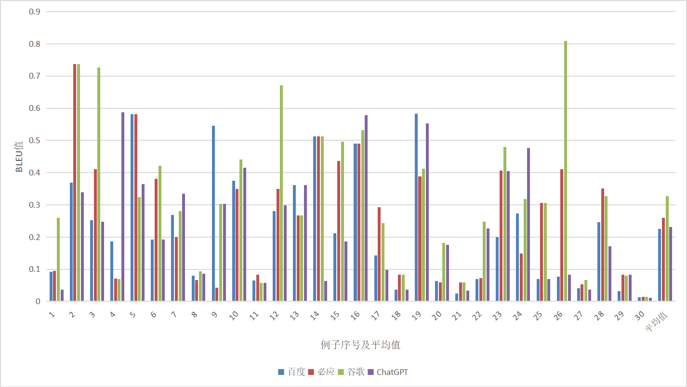

# <center>技术报告</center>

### <center>熊伟强 2020K8009925009</center>

## 项目要求
&emsp;&emsp;编写程序，实现BLEU值的计算。可以从网络上选择高质量的平行句对，利用所写的BLEU值计算程序和平行句对，计算三个不同翻译引擎（如百度、搜狗、微软“必应”等）的译文BLEU值。完成一份对比实验和分析报告。

## BLEU评价指标
### 原理概述
&emsp;&emsp;首先我们来回顾一下什么是BLEU。BLEU（Bilingual Evaluation Understudy）是最早提出的机器翻译评价指标。其核心思想是将机器产生的候选译文（candidate）和若干个参考译文（reference）相比较，候选译文和参考译文越接近，候选译文的准确率就越高。BLEU的计算式如下：

$$
BLEU = BP \times \exp{(\sum_{n=1}^N{\mathrm{w}_n \log p_n})}
$$

&emsp;&emsp;其中$BP$为简短惩罚（brevity penalty），$\mathrm{w}_n$为权重（通常取$1/N$），$p_n$为出现在参考译文中的n元词语接续组占候选译文中n元词语接续组总数的比例,$N$一般取4。

&emsp;&emsp;BLEU使用n元语法来判断精确度（precision），也即公式中的$p_n$。$p_n$的计算公式如下：

$$
p_n = \frac{\sum_{C\in\{\mathrm{Candidates}\}}\sum_{\mathrm{n\textrm{-}gram}\in C}\mathrm{Count}_{\mathrm{clip}}(\mathrm{n\textrm{-}gram})}{\sum_{C^\prime\in\{\mathrm{Candidates}\}}\sum_{\mathrm{n\textrm{-}gram}\in C^\prime}\mathrm{Count}(\mathrm{n\textrm{-}gram^{\prime}})}
$$

&emsp;&emsp;这个公式看上去有一些复杂。在此给出一些例子来理解这个公式。

```
Example 1:
Candidate 1: The cat is sitting on the mat.
Reference 1: The cat is on the mat.
Reference 2: There is a cat on the mat.
```

&emsp;&emsp;当$n=1$时，我们考虑$p_1$以及1元语法。`Candidate 1`被切分成：`the`（在这里，大小写是无关紧要的）、`cat`、`is`、`sitting`、`on`、`the`、`mat`。同样地，`Reference 1`和`Reference 2`也可以做这样的切分。之后将`Candidate 1`的1元词组和所有的参考译文进行匹配，发现有6个1元词组（除了`sitting`）在参考译文中都出现过，因此$p_1=\frac{候选译文所有1元词组和参考译文中所有1元词组匹配的个数}{候选译文1元词组的总个数} = \frac{6}{7}$。

&emsp;&emsp;同理，当$n=2$时，我们对候选译文和参考译文进行同样的切分和匹配。候选译文有6个2元词组：`the cat`、`cat is`、`is sitting`、`sitting on`、`on the`、`the mat`，除`is sitting`、`sitting on`外，其它2元词组均在参考译文的2元词组里出现过。可以求得$p_2 = \frac 4 6 = \frac 2 3$。

&emsp;&emsp;因此公式的两个求和符号，实际上是对候选译文和参考译文进行遍历：分母遍历所有的候选译文，求出所有候选译文所包含的n元词组之和；分子除了找到候选译文的所有n元词组之外，还要遍历所有的参考译文，找到参考译文的所有n元词组，并且将候选译文的n元词组与参考译文的进行匹配，完全匹配才作计数。

&emsp;&emsp;不难注意到，求$p_n$的式子里还有一个名为`clip`的下标。`clip`意为“修剪、裁剪”，这意味着之前我们分子的计算不是完全可靠的，有一些匹配结果需要去掉。比如下面的这个例子：

```
Example 2:
Candidate 1: the the the the the the the
Reference 1: The cat is on the mat.
Reference 2: There is a cat on the mat.
```

&emsp;&emsp;在这个例子中，候选译文的$p1$的值达到了惊人的1。尽管计算$p2$可以让候选译文“现出原形”，但这暴露了目前精确度计算上的一个问题：候选译文可以反复出现某些n元组，以提高其精确率。为此我们需要一个修正的n元精确度（modified n-gram precision）：在识别出匹配的候选单词之后，参考单词应该被认为已经用过。比如在第二个例子中，参考译文中最多只出现了2个`the`。我们可以认为，`the`的出现次数应该是有限制的（最多为2）。因此在计算$p_1$的时候，我们只能匹配`Candidate 1`中的2个`the`，故修正后，$p_1 = \frac{2}{7}$。更一般地，$\mathrm{Count}_{\mathrm{clip}} = \min{(\mathrm{Count}, \mathrm{Max\_ Ref \_ Count})}$，其中$\mathrm{Max\_ Ref \_ Count}$为该n元词组在单个参考译文中出现的最大次数。

&emsp;&emsp;即使如此，这样的评测方式依然有漏洞。比如下面的例子：

```
Example 3:
Candidate 1: the cat
Reference 1: The cat is on the mat.
Reference 2: There is a cat on the mat.
```

&emsp;&emsp;在这个例子中，$p_1$和$p_2$的结果都是1。这说明候选译文越短，并且只需要匹配参考译文的部分词组序列就能得到很高的结果。由此我们引入了简短惩罚(brevity penalty)：如果候选译文比所有的参考译文的单词数量都要少，那么候选译文应当缺失了一部分信息，应当受到惩罚，其计算式如下：

$$ BP=\left\{
\begin{aligned}
&1 &\mathrm{if}\ c > r\\
&e^{(1 - r / c)} &\mathrm{if}\ c \leq r\\
\end{aligned}
\right.
$$

&emsp;&emsp;其中$c$、$r$分别为候选译文长度、有效参考语料库长度。

&emsp;&emsp;对于第3个例子，我们可以计算其简短惩罚：$BP = e^{(1-6/2)} \approx 0.14$。BLEU的分值在0和1之间，而第三个例子的$BP$极大限制了候选译文的得分上限，效果是比较明显的。

&emsp;&emsp;当然候选译文的长度不能太长也不能太短。我们已经给出了译文过短的惩罚，那么需不需要再给出一个译文过长的惩罚？实际上我们此前已经给出了惩罚：过长的译文会造成冗余，而冗余要么不匹配，要么匹配了会被修剪掉。

&emsp;&emsp;最后，BLEU公式中，括号内的式子求和上限$N$一般定为4，即我们最多只计算到$p_4$。这是因为$p_n$的值通常会随着$n$增大快速减小。如果候选译文中有一个单词没有在参考译文中出现，那么包含这个词的词组都将无法匹配，$n$越大，受影响的词组范围越大。当$N$过大时，除非候选译文和参考译文一致，否则很难得到高分，没有区分度。当然$N$过小也不行，最极端地，当$n=1$时，我们可以构造下面的一个例子：

```
Example 4: on cat the the mat sitting is
Reference 1: The cat is on the mat
Reference 2: There is a cat on the mat.
```

&emsp;&emsp;显然，对于这个例子，$p_1 = \frac 6 7$，然而句子顺序完全混乱。事实上，使用n元语法评分考虑了译文的两个方面：充分性和流畅性。采用1元语法是考虑译文的充分性（要求给出尽可能完整的信息），采用2元以上的语法是考虑译文的流畅性（要求词语之间有正确的顺序）。最后，再对得到的结果进行加权平均（即$\mathrm{w_n}$，通常权值一样，即$1/N$）。

## BLEU计算实现

&emsp;&emsp;此处笔者给出一个简单的[Python实现](/BLEU.py)。笔者选取WMT18的30个中译英句子，对百度、必应和谷歌翻译的结果进行测试。由于这三个翻译工具产生的结果是稳定的，即对于同样的输入，只会输出同样的结果，以及参考译文也是唯一确定的，故此处实现的BLEU只针对1个候选译文和1个参考译文的情形。部分读者会发现，ChatGPT生成的结果也在其中。事实上，ChatGPT生成的结果是不稳定的，故此处ChatGPT的BLEU评价结果与其它翻译工具结果不具有可比性。

```python
def preprocess(text):
    for line in text:
        newline = line.strip('\n')
        newline = newline.lower()
        newline = re.sub(r'^\d+\.\s', ' ', newline)
        newline = re.sub(r'\b[.,?!;:"\']+\B', '', newline)
        newline = newline.strip()
        newline = newline.split(' ')
        text[text.index(line)] = newline

# read the reference data
reference = open('testdata/reference30.txt', 'r', encoding='utf-8').readlines()
preprocess(reference)

# data of candidates
baidu = open('result/Baidu.txt', 'r', encoding='utf-8').readlines()
preprocess(baidu)
bing = open('result/Bing.txt', 'r', encoding='utf-8').readlines()
preprocess(bing)
google = open('result/Google.txt', 'r', encoding='utf-8').readlines()
preprocess(google)
gpt = open('result/ChatGPT.txt', 'r', encoding='utf-8').readlines()
preprocess(gpt)
```

&emsp;&emsp;首先我们读入测试数据，并且对数据进行预处理。起初读取的数据如下列表：
```python
[
'1. During heavy training, ... energy needs.\n',
'2. This volcano ... \n',
...
]
```

&emsp;&emsp;经过去除序号、标点、大写转小写、切分等操作后，原数据处理成如下列表：
```python
[
['during', 'heavy', ..., 'needs'],
['this', 'volcano', ..., 'deaths'],
...
]
```

&emsp;&emsp;接着我们对每个切分后的句子，生成对应的n-gram：

```python
# generate the n-gram
def ngram(text, n):
    ngram = []
    for i in range(0, len(text)-n+1):
        ngram.append(text[i:i+n])
    return ngram
```

&emsp;&emsp;以下是BLEU的计算实现。原程序还包括输出部分，在此省略。

```python
def BLEU(candidate, reference, loc):
    score = 0
    score_BP = 1
    # calculate the brevity penalty
    if len(candidate[loc]) < len(reference[loc]):
        score_BP = math.exp(1 - len(reference[loc])/len(candidate[loc]))

    for j in range(1, 5):
        count = 0
        ngram_score = 0
        ngram_ref = ngram(reference[loc], j)
        ngram_trans = ngram(candidate[loc], j)
        count_dict = {}

        # count the number of n-gram
        for gram in ngram_ref:
            if str(gram) not in count_dict:
                count_dict[str(gram)] = 1
            else:
                count_dict[str(gram)] += 1
        for k in range(0, len(ngram_trans)):
            if ngram_trans[k] in ngram_ref:
                if count_dict[(str(ngram_trans[k]))] > 0:
                    count += 1
                    count_dict[(str(ngram_trans[k]))] -= 1

        # smoothing
        if count != 0:
            ngram_score = count / len(ngram_trans)
        else:
            ngram_score = 0.1 / len(ngram_trans)
        score += math.log(ngram_score)
    score = math.exp(score/4)
    score *= score_BP
```

&emsp;&emsp;首先我们初始化`score`和`score_BP`，分别对应最终BLEU得分和$BP$。`score_BP`的值依靠一个条件判断实现：若候选译文比参考译文短，则计算惩罚因子。外循环的`j`取值范围为1到4，对应1到4元语法。`loc`对应具体哪一个测试例子，取值范围为0到29。`for ngram in ngram_ref`循环体中的`count_dict`记录参考译文每个词组出现次数，`for k in range (0,len(ngram_trans))`则进行候选译文和参考译文匹配，匹配成功还需要对`count_dict`进行修改，这对应BLEU的`clip`操作。

&emsp;&emsp;在计算$p_n$的时候，有时会遇到$p_n = 0$的情况。而$p_n$外部的$\log$函数不允许$p_n = 0$。因此需要引入一个平滑函数，给$p_n$一个较小的非负值。常见的平滑方法有加1法、Good-Turing等。这里笔者参考`NLTK`计算BLEU的平滑策略1，给$\mathrm{Count}_\mathrm{clip}$赋一个较小值（默认为0.1）。
最后进行平均等操作得到最终结果。

&emsp;&emsp;笔者还导入`NLTK`对应的BLEU计算函数，来验证最终结果是否正确：

```python
# check the result
if abs(score - sentence_bleu([reference[loc]], candidate[loc], smoothing_function=SmoothingFunction().method1)) > 1e-5:
    print('ERROR')
    print('BLEU score of NLTK: ' + str(sentence_bleu([reference[loc]], candidate[loc], 
            smoothing_function=SmoothingFunction().method1)))
    exit()
```

## 结果分析
&emsp;&emsp;首先，被测试的四个工具生成的结果基本做到了语句通顺、没有明显的语法错误，没有出现BLEU考虑到的极端情况（句子过短、无意义的单词或短语重复等）。四种翻译工具的最终结果如下所示：


<center>四种翻译工具的BLEU值</center>

&emsp;&emsp;可以看到，总体上而言，所有翻译工具的BLEU值均不是特别理想。这很大程度上是因为参考译文过少。比如以下例句：

```
Example 5:
Source language: 观众中黑人和白人几乎各占一半。

Candidate 1: The audience was almost evenly divided between blacks and whites.

Reference 1: The audience is almost evenly split between black and white.
```

&emsp;&emsp;笔者主观认为，候选译文的评分理论上应当是比较高的。而其BLEU值只有0.07——原因是2-gram到4-gram的评分都相当低。笔者认为，如果添加多个优秀的参考译文，BLEU的值应当会更符合实际一些。

&emsp;&emsp;鉴于本项目BLEU的评分结果普遍偏低，不太具有参考价值，笔者打算从其它方面考察译文质量。本次测试的30个例子具有一些规律，我们不妨从人的直观感受出发，来评价本次测试的结果。由于英语并非笔者母语，对于一些句子的翻译结果，可能评价上会有一定偏差，敬请读者斧正。

&emsp;&emsp;测试的第1到第5个例子是一些比较简单的句子。下面以第4个句子为例，考察翻译工具的翻译水平：

```
Sentence 4:
Source language: 观众中黑人和白人几乎各占一半。

Reference: The audience is almost evenly split between black and white.

Baidu: Almost half of the audience is black and white.

Bing: Almost half black and half white in the audience.

Google: The audience was almost evenly divided between blacks and whites.

ChatGPT: The audience is almost evenly divided between black and white individuals.
```

&emsp;&emsp;基本上4个翻译结果都能翻译出句子的主要部分。除了Bing的结果有一处语病（没有be动词）。另外，百度的翻译结果似乎
有一些偏差：其似乎是在表达，有一半的观众是由黑人和白人组成的。

&emsp;&emsp;测试的第6到第10个例子均包含一些四字词语或成语。这需要翻译工具理解这些词语的意思，其中有一些词语不适合直译，以及部分词语在不同语境下会有其它涵义。下面以第10个句子为例：

```
Sentence 10:
Source language: 但如果他们试图签约我们的球员，那他们也要自食恶果。

Reference: But if they try to sign one of our players, they'll face consequences.

Baidu: But if they try to sign our players, they will also suffer the consequences themselves.

Bing: But if they try to sign our players, they will also have to suffer the consequences.

Google: But if they try to sign our players, they will suffer the consequences.

ChatGPT: But if they try to sign our players, they will also face the consequences.
```

&emsp;&emsp;所有的翻译工具都准确地翻译出了“自食恶果”的含义。而本例子的BLEU值也不高，而问题出在参考译文的“one of”上。由于没有上下文，导致翻译工具的结果均出现偏差，参考译文的数量太少让本不富裕的BLEU值雪上加霜。事实上，如果将这一句单独拿出来翻译，翻译工具的结果都是不错的。

&emsp;&emsp;测试的第11到第15个例子含有一些比较常见的专有名词，重点考察翻译工具对这些名词的翻译能力。下面以第12个句子为例：

```
Sentence 12:
Source language: 脸书被批评为所谓假新闻的主要传播点之一，许多人认为脸书影响了 2016 年美国总统大选。

Reference: Facebook has been criticized as being one of the main distribution points for so-called fake news, which many 
           think influenced the 2016 U.S. presidential election.

Baidu: Facebook has been criticized as one of the main dissemination points of the so-called Fake news, and many people 
       believe that Facebook has affected the 2016 US presidential election.

Bing: Facebook has been criticized as one of the main propagators of so-called fake news, and many believe that Facebook 
      influenced the 2016 US presidential election.

Google: Facebook has been criticized as one of the main distribution points for so-called fake news, which many believe 
        influenced the 2016 US presidential election.

ChatGPT: Facebook has been criticized as one of the main disseminators of so-called fake news, and many believe it had an 
         impact on the 2016 US presidential election.
```

&emsp;&emsp;事实上，所有的翻译工具都准确地翻译了这部分的专有名词。另外在这个例子中，我们看到有一些词义相近的词语，比如`distribution`和`dissemination`，BLEU并没有考虑词义之间的区别，而直接将这部分全权交给了参考译文，因此参考译文的质量和数量极大影响着BLEU的可信成度。

&emsp;&emsp;测试的第16到第20个例子为一些人名的翻译。笔者认为，这部分的翻译难度是相当大的。可能源语言出现的人名并非来自于本语言，部分音译名来自其它语言，但出于历史或其他原因导致其很容易与本语言的人名混淆。在没有上下文的情况下，精通原语言和目标语言的翻译家也可能束手无策。但本部分的人名翻译让笔者眼前一亮，部分翻译结果是笔者意想不到的。

```
Sentence 18:
Source language: 不同寻常的是，林博实际上被一些东西所打动。

Reference: Rather unusually, Limbaugh actually hit on something.

Baidu: Unusually, Lin Bo was actually moved by something.

Bing: Unusually, Limbaugh was actually struck by something.

Google: Unusually, Limbaugh was actually moved by something.

ChatGPT: Unusually, Lin Bo was actually moved by something.
```

&emsp;&emsp;在没有上下文的情况下，以汉语为母语的人很难将林博翻译成Limbaugh。笔者推测部分翻译工具可能有一套人名及其它专有名词的翻译表。翻译工具在这个地方有时优于常人，算是意料之外，情理之中。不过由于没有上下文，以人的视角来看，不管是将“林博”认为是中文名还是外文名，都有其合理性。

```
Sentence 20:
Source language: 男子50米仰泳，中国选手徐嘉余以23秒54的成绩排名第八，日本选手谷赫纯也以22秒85夺冠。

Reference: In the men's 50-meter backstroke, Koga Junya from Japan won the champion with 22'85 and Chinese athlete Xu Jiayu 
           ranked eighth with 23'54.

Baidu: In the men's 50 meter backstroke, Xu Jiayu of China ranked eighth with a time of 23.54 seconds, and Gu Hechun of 
       Japan also won the championship with a time of 22.85 seconds.

Bing: In the men's 50m backstroke, China's Xu Jiayu finished eighth in 23.54 seconds, and Japan's Gu Hechun also won in 22.85 
      seconds.

Google: In the men's 50m backstroke, China's Xu Jiayu ranked eighth with a time of 23.54 seconds, and Japan's Gu Hechun also 
        won the championship with a time of 22.85 seconds.

ChatGPT: In the men's 50m backstroke, Chinese swimmer Xu Jiayu ranked eighth with a time of 23.54 seconds, while Japanese 
         swimmer Katsuhiro Matsumoto won the gold with a time of 22.85 seconds.
```

&emsp;&emsp;第20个测试例子具有一定的歧义。常人在断句时也可能将日文人名“谷赫纯也”从中断开，将“也”作为副词。除了ChatGPT外，其它翻译工具都将“谷赫纯”作为一个中文人名来看待。令人哭笑不得的是，ChatGPT虽然断句正确，但将人名错误地译成另外一个日本游泳运动员的人名。实际上，这一部分并不是考察翻译工具翻译水平的高低，更应该算是对翻译工具翻译行为的观察。

&emsp;&emsp;测试的第21到第25个例子考察对影视、文艺作品以及历史文件名的翻译。这部分和上一部分的测试一样，都需要发挥人的主观能动性：影视、文艺作品需要深入了解其内容后再给出翻译，且往往不直译；历史文件通常对一些词有严格的要求。因此这一部分对翻译质量的评估意义不是很大，仅作为一种测试的拓展。

&emsp;&emsp;测试的第26到第30个例子则具有比较强烈的文化色彩。部分用语或俚语是原语言特有的，并且与字面义大相径庭，需要了解原语言的一些文化背景才能理解背后的含义。比如以下两个例子：

```
Sentence 27:
Source language: 其次爱剁手的法国网民，人均网购额为1925美元，而他们网购最多的商品，是服装，不愧是爱时尚的国度。

Reference: Elsewhere, per capita online shopping of French netizens who are obsessed with online shopping amounted to 
           US$1,925. Goods they purchased online are primarily clothing, worthy of being called a nation of fashion lovers.

Baidu: Secondly, French netizens who love to chop hands have an average online shopping volume of 1925 US dollars, and their
       most popular product online is clothing, which is truly a country that loves fashion.

Bing: The second French netizens, who love chopping hands, have an average online purchase of $1,925, and the most common 
      product they buy online is clothing, which is worthy of being a country that loves fashion.

Google: French netizens who love to shop next, spend an average of US$1,925 on online shopping per capita, and their most 
        online shopping item is clothing, which is worthy of being a country that loves fashion.

ChatGPT: French netizens who love shopping spend an average of $1,925 online, and the most popular item they purchase online 
         is clothing, showcasing their love for fashion.

Sentence 30:
Source language: 益者三友，友直，友谅，友多闻。

Reference: There are three friendships which are advantageous. Friendship with the upright; friendship with the sincere; 
           and friendship with the observant.

Baidu: Beneficial three friends, friends are direct, friends are understanding, and friends are knowledgeable.

Bing: The three friends of the beneficial, the friend straight, the friendly forgiveness, and the friend more smell.

Google: The three friends of the beneficiary are straight friends, forgiving friends, and informative friends.

ChatGPT: The three virtues of benefactors are sincerity, understanding, and being well-informed.
```

&emsp;&emsp;第27个测试句子中出现了“剁手”二字。百度和必应翻译直接将“剁手”理解为字面意义上的剁手，而谷歌翻译和ChatGPT则理解了其背后涵义——疯狂购物。第30个测试句子为文言文。在“益者三友”上，每种翻译之间都有一定的分歧，而后面的“友直，友谅，友多闻”，除了必应（将多闻翻译成more smell）外，都能基本理解其大意。

&emsp;&emsp;当然，仅靠30个例子测试远不能评价翻译工具的能力。报告也没有展示所有的测试结果，感兴趣的笔者可以在[result](./result/)、[testdata](./testdata/)等目录下查看详细信息。

## 总结

&emsp;&emsp;通过本次项目，笔者对BLEU有了更进一步的了解。通过阅读论文原文，了解了科研工作者们在这一领域遇到的困难和解决问题的尝试，明白了BLEU的提出考虑了哪些方面。当然，BLEU的解决方案不是完美的，但无疑是一个巨大的进展。以下来谈谈笔者认为BLEU的优点和不足之处。

#### BLEU的优点
&emsp;&emsp;BLEU给笔者的最直观感受是计算简单明了。BLEU的设计思想很明确：直接让候选译文和参考译文比较，通过n元语法评价其相似程度。通过n元语法的计算方式是相当简单的，从笔者通过Python简单实现BLEU的计算可见一斑。并且这种方法是快速的，能够在短时间内得到结果。

&emsp;&emsp;此外，BLEU可以在质量较高的参考译文下得到一个比较正确的结果。结合BLEU的评分机制，评分较高的译文在人工评分下通常也较高。

&emsp;&emsp;BLEU的适用范围也是比较广的。BLEU不需要考虑语言的特点，只考虑字符串的相似程度。对于英语、法语等不需要分词的语言来说，应用BLEU是相当简单的。而对于汉语、日语等语言，则需要在评测前进行分词。由于分词工作在自然语言处理的其它领域也会用到，人们在分词领域也做了大量工作，获取对应的分词语料也是比较容易的。以上使得BLEU的应用范围相当广泛。

#### BLEU的不足

&emsp;&emsp;BLEU的不足之处也是比较明显的。在本项目中，由于参考译文数量上的不足，导致翻译工具的评分结果普遍偏低。在测试中有一些句子脱离了上下文，参考译文和候选译文在部分信息上也有不一致的情况。这说明BLEU十分看重参考译文的质量和数量。因此在评测前，人们需要提前准备优质且大量的参考译文数据。

&emsp;&emsp;BLEU忽略了语言的语义和结构。在很多情况下，一些近义词可以互换，比如英语中的`happy`和`glad`。语法上，同一个句子可以采用不同的结构表达。比如下面的例子：

```
Sentence 1: It is wonderful to be a scientist.
Sentence 2: Being a scientist is wonderful.
```

&emsp;&emsp;如果要弥补这一点，人们可以生成更多的参考译文。如果句子较长，则可以替换的部分可能更多，可以选择的组合将会指数级增长。此时参考译文往往无法覆盖所有的正确译文。这与BLEU的初衷是相违背的：用一种自动化的方式来代替人工评分，而此举可能在加重人工负担的同时，得到的结果不一定比人工评测更好。可以通过缩短句子长度避免这样的组合爆炸情况产生，但这样会使BLEU的应用范围受到限制。此外，这一方案可能会削弱$BP$对短句的惩罚。

&emsp;&emsp;BLEU对于错误的惩罚是没有权重的，这也是不考虑语义带来的缺陷。有些情况下，部分语言细微的差别会使得语义发生较大变化。比如以下例子：

```
Candidate: Not all of us can speak English.
Reference: All of us can speak English.
```

&emsp;&emsp;这个例子在BLEU评分中达到了0.81。而参考译文和候选译文在语义上则有较大差别。相似但不完全等同，有时这种情况是可以接受的，而有时则不可接受。在一些特定场合，比如政府发布的公文或者法律条例，有特殊的遣词要求，仅凭借相似程度进行评分是不合适的。对于译文中关键的信息，如果候选译文错译或漏译，应当给予较重的惩罚；对于一些虚词，错译漏译的惩罚应当较小。而这些方面是基于语义的，在BLEU评价指标基础上很难进行改进。

## 参考文献
[1] Papineni, K., Roukos, S., Ward, T., & Zhu, W. J. (2002, July). Bleu: a method for automatic evaluation of machine translation. In Proceedings of the 40th annual meeting of the Association for Computational Linguistics (pp. 311-318).