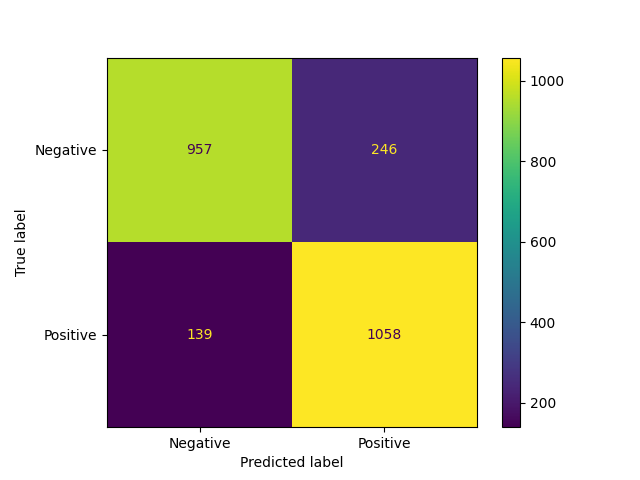
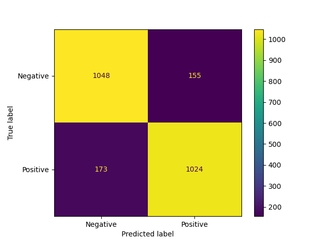

# <center>技术报告</center>

### <center>熊伟强 2020K8009925009</center>

## 项目要求
&emsp;&emsp;利用公开的情感或情绪分析评测语料，对比分析统计学习方法和神经网络方法的性能差异，并进行错误分析。

## 统计学习方法

&emsp;&emsp;多项式朴素贝叶斯（Multinomial Naive Bayes，以下简称MNB）模型是一种在文本分类中常见的分类方法。在本次作业中笔者将采用该分类器，配合TF-IDF文本表示方法完成任务。以下是相关代码（位于[MNB.py](./MNB.py)）：

```Python
# Importing the dataset
dataset = pd.read_csv('data.csv')
review = dataset['review'].values
sentiment = dataset['sentiment'].values

for index in range(len(review)):
    review[index] = review[index].replace('\n', ' ')
    oldline = review[index]
    newline = jieba.cut(oldline, cut_all=False)
    review[index] = " ".join(newline)

mystopwords = []
with open('.\\stopwords\\stopwords.txt', 'r', encoding='utf8') as f:
    words = f.readlines()
    for word in words:
        new_word = word.strip()
        mystopwords.append(new_word)
```
&emsp;&emsp;首先我们导入数据[data.csv](./data.csv)和[stopwords.txt](./stopwords/stopwords.txt)。前者是将课程网站上的情感分析语料整合得到的数据集；后者是停用词表，由[中文停用词表](./stopwords/cn_stopwords.txt)、[哈工大停用词表](./stopwords/hit_stopwords.txt)、[百度停用词表](./stopwords/baidu_stopwords.txt)、[四川大学机器智能实验室停用词库](./stopwords/scu_stopwords.txt)整合得到[^1]。我们在读入数据集时使用`jieba`进行了分词处理，停用词用于过滤掉数据集中一些无用的词语（比如助词）或符号。

```Python
# splitting the dataset
Xtrain, Xremain, Ytrain, Yremain = train_test_split(review, sentiment, test_size=0.4, random_state=7)
Xtest, Xvalid, Ytest, Yvalid = train_test_split(Xremain, Yremain, test_size=0.5, random_state=7)

# converting to list
t1=Xtrain.tolist()
t2=Ytrain.tolist()
train_list = {'review':t1, 'sentiment': np.array(t2)}

t3=Xvalid.tolist()
t4=Yvalid.tolist()
valid_list = {'review':t3, 'sentiment': np.array(t4)}

t5=Xtest.tolist()
t6=Ytest.tolist()
test_list = {'review':t5, 'sentiment': np.array(t6)}

# dataframe
train_list = pd.DataFrame(train_list)
valid_list = pd.DataFrame(valid_list)
test_list = pd.DataFrame(test_list)
```

&emsp;&emsp;此处笔者按照3:1:1的比例将数据集分成了训练集、验证集、测试集三份，并将其转化为DataFrame数据结构方便后续训练和测试。其中验证集用于自动化调整模型的超参数。

```Python
alphalist = [0.001, 0.005, 0.01, 0.05, 0.1, 0.5, 1, 5, 10, 50, 100]
clf_list = []
maxscore = 0
best_alpha = 0

for i in alphalist:
    clf = MultinomialNB(alpha=i)
    vectorizer = TfidfVectorizer(stop_words=mystopwords, max_df=0.8, min_df=3)
    X_train = vectorizer.fit_transform(train_list["review"].values.astype('U'))
    Y_train = train_list['sentiment']
    clf_list.append(clf.fit(X_train, Y_train))
    X_valid = vectorizer.transform(valid_list['review'].values.astype('U'))
    Y_valid = valid_list['sentiment']
    pred = clf.predict(X_valid)
    score = f1_score(Y_valid, pred)
    if score > maxscore:
        maxscore = score
        best_alpha = i
    print("alpha =", i, "score =", score)

print("Choose alpha =", best_alpha, "as the best alpha.")

index = alphalist.index(best_alpha)
clf = clf_list[index]
X_test = vectorizer.transform(test_list['review'].values.astype('U'))
Y_test = test_list['sentiment']
pred = clf.predict(X_test)
score = f1_score(Y_test, pred)
print("Test score = ", score)
```

&emsp;&emsp;以上是训练和测试MNB模型的过程，笔者在`alphalist`设置了若干超参数，去除停用词后使用训练集进行训练，在验证机上使用F1-score进行评分，选出评分最高的对应模型进行测试。最终结果如下：

```
alpha = 0.001 score = 0.8314144736842104
alpha = 0.005 score = 0.8331273176761433
alpha = 0.01 score = 0.8341584158415841
alpha = 0.05 score = 0.838789888106092
alpha = 0.1 score = 0.84
alpha = 0.5 score = 0.8454810495626822
alpha = 1 score = 0.8474012474012474
alpha = 5 score = 0.8488278092158448
alpha = 10 score = 0.8427773343974462
alpha = 50 score = 0.8317901234567902
alpha = 100 score = 0.8265151515151515
Choose alpha = 5 as the best alpha.
Test score = 0.8487765744083433
```

### 神经网络方法

&emsp;&emsp;本次任务笔者采用词袋模型和多层感知机（Multilayer Perceptron，以下简称MLP）进行训练。此部分的训练（[MLP.py](./MNB.py)）和MNB模型的训练大同小异，以下仅阐述与MNB模型不同的部分。
```Python
# build bag of words
words = []
for line in review:
    words.append(line)
vectorizer = CountVectorizer(stop_words=None, max_features=5000)
modified_review = vectorizer.fit_transform(words).toarray()
words_bag = vectorizer.vocabulary_
pd.DataFrame(review)

```
&emsp;&emsp;首先是构建词袋。词袋使用`CountVectorizer`统计词汇在该训练文本中出现的频率，注意到这里笔者没有使用停用词，并且最大特征数限制在的5000，接着将文本转化为特征向量。后续数据集的切分和MNB部分保持一致，采用同样的随机数切分。训练模型调用、调参部分和MNB部分相似，在此不作赘述。最终结果如下：

```
alpha = 0.001 score = 0.844216816047802
alpha = 0.005 score = 0.8617683686176838
alpha = 0.01 score = 0.8501043841336117
alpha = 0.05 score = 0.8613445378151261
alpha = 0.1 score = 0.8560541913632513
alpha = 0.5 score = 0.8673684210526317
alpha = 1 score = 0.8628113127902068
alpha = 5 score = 0.8654822335025381
alpha = 10 score = 0.8583690987124464
Choose alpha = 0.5 as the best alpha.
Test score:  0.8619528619528619
```

## 性能差异

&emsp;&emsp;从上一部分的结果可以看出，MNB和TF-IDF结合的统计学习方法和MLP和词袋模型结合的神经网络方法相比，神经网络方法的评分稍微高一些。但是性能上，统计方法的训练时间要比神经网络的方法要快很多，得分上和神经网络方法差距很小。因此总体来说，在本次任务中，统计学习方法和神经网络方法都取得了较好的结果，并且在小规模的数据集上，在评测结果几乎没有差别的情况下，统计学习方法不失为更优的选择。

## 错误分析

### 统计学习方法

&emsp;&emsp;此处笔者给出MNB模型测试结果的混淆矩阵：


<center>MNB模型混淆矩阵</center>

&emsp;&emsp;从图中可以看到，测试集的正面情绪和负面情绪的样本选取是比较均匀的。我们观察预测错误的样本，发现预测为正面情绪而实际为负面情绪（FP）的例子和预测为负面情绪而实际为正面情绪的例子（FN）要多很多。由此引出本次任务的几个问题。

&emsp;&emsp;第一，TF-IDF对停用词表相当依赖。TF-IDF通常需要对文本进行停用词处理。然而，停用词表的构建和选择并非易事。在笔者整合的停用词表中，有一些词在本次任务中是不应该出现的，比如`不`、`一般`等。停用词表的构建具有较强的主观性和领域依赖性，不同任务的停用词表可能会有很大不同。本次任务中就有这样一个例子：
```
原文：很一般啊，和很多绘本比起来，并不精彩。
切词且消除停用词后：绘本 精彩
```
&emsp;&emsp;作为一个典型的负面情绪样本，经过处理后变成了一个看似是正面情绪的样本。一些否定词（比如`不`）、多义词（比如`一般`）被清除掉，可能会造成语义上的反转。笔者猜测，这或许是混淆矩阵FP比FN多将近一倍的原因之一。

&emsp;&emsp;第二，MNB模型依赖特征条件独立的假设。该假设要求用于分类的特征在类确定的条件下是条件独立的。但是在文本中的词语往往具有一定的上下文关联性，选取的特征之间也会有或多或少的相互关联。这个假设可能会导致模型无法捕捉到词语之间的语义关系。

&emsp;&emsp;第三，TF-IDF仅通过词频来判断一个词的重要性。同样地，TF-IDF也没有考虑词语在上下文中的地位，也没有提供语义信息。不过这也是其能和不考虑语义关系的朴素贝叶斯模型相性很好的原因。

&emsp;&emsp;总而言之，本次任务中统计学习方法没有很好的考虑到上下文和语义相关的问题，这应该是测试结果错误部分的主要原因。

### 神经网络方法

&emsp;&emsp;此处笔者给出MNB模型测试结果的混淆矩阵：


<center>MLP模型混淆矩阵</center>

&emsp;&emsp;可以看到，MLP模型从正确率上来看要比MNB模型略高一些，但是FN和FP的情况则略有变化。由于神经网络可解释性比较差，很难判断预测错误的原因是什么。但是从文本表示上来说，词袋模型和TF-IDF模型一样，具有语义信息缺失的问题，并且词袋模型没有像TF-IDF表示权重的功能。在这样的情况下MLP模型在评分上还略优于MNB模型，可以体现出神经网络的优势。

### 难区分样本

&emsp;&emsp;笔者还记录了两种方法预测错误的样本（[MNB_false_results.csv](./MNB_false_results.csv)和[MLP_false_results.csv](./MLP_false_results.csv)）。从这些错误样本中，部分例子的确较难判断（评价已经过`jieba`分词）：
| 评价 | 预测结果 | 实际结果 |
| :--: | :-----: | :-----: |
|服务 应该 再 提升 一下 ． 怎么 也 要 符合 五星 的 标准 啊      | negative | positive |
| waste   of   my   money .     My   children   are   not   interested . | positive | negative |
| 这 真是 一本 好书 ， 而且 价钱 又 便宜 。 真好 呀 ！| positive | negative |
| 酒店 地段 尚可 ， 离 火车站 和 沃尔玛 超市 比较 近 （ 需要 打车 ） ， 大厅 和 前面 的 停车场 都 比较 宽畅 。 房间 里 设施 也 不错 ， 不足 之错 有 三点 ： 一 、 网络 不 稳定 ， 好几个 房间 上 不了 网 ， 网线 和 插口 很 破旧 ， 偶尔 会 断线 。 二 、 大厅 小卖部 铁将军把门 ， 想 买点 东西 需要 去 外面 买 。 三 、 餐厅 提供 的 经济 套餐 名不符实 ， 25 元 的 套餐 跟 外面 卖 5 块钱 的 差不多 ！     宾馆 反馈   2008 年 3 月 27 日   ：   尊敬 的 客户 ： 您好 ！ 感谢 你 对 金城 大酒店 的 支持 ， 对于 你 反映 的 三个 问题 我们 已经 反馈 到 酒店 相关 部门 。 谢谢 ！| negative | positive |
| 看 了 一点 &# 183 ; &# 183 ; 就 没 看 了 &# 183 ; &# 183 ;| positive| negative |
&emsp;&emsp;从以上例子可以看出，这些样本对于机器来说是挺难区分的：这些样本有的使用了反语，有的使用其它语言，有的正面和负面情感都有，有的使用的语言格式不规范，有的可能单纯是标记错误……这些都是文本分类中遇到的噪声。部分噪声是很难清楚的，我们只能尽力减小这一部分的影响。一方面我们需要提高数据集的质量，一方面我们也需要研究具有更强抗噪能力的模型。

## 后记

&emsp;&emsp;在本次任务之前，笔者以为如今神经网络大行其道，许多曾经流行的统计方法已经被碾压，成了明日黄花。但在本次任务之后，笔者看到统计方法依然有不逊于神经网络的优点，以及神经网络在性能上的一些不足之处。这两种方法如今都有研究和发展的必要。
&emsp;&emsp;回首NLP的历史，从想法的提出到后续的实践，人类得以逐渐跨过语言的障碍，增进了相互理解和合作友谊，人们得以更加紧密地凝聚在一起。在此笔者向所有在自然语言处理方向做出贡献的人们致以崇高敬意，感谢你们在这几十年间为人类社会发展做出的不懈努力与巨大贡献！祝愿你们在这个不断发展的领域中取得更大的成就，祝愿世界人民大团结早日到来！

[^1]: 项目地址：https://github.com/goto456/stopwords